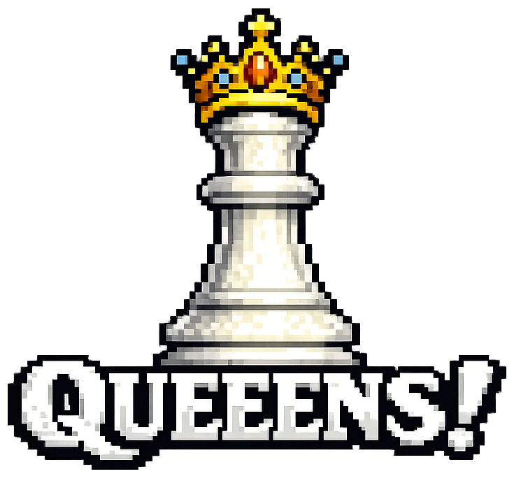

## ▶️ Acceso a la aplicación web

[¡Juega ahora en GitHub Pages!](https://dierodfer.github.io/queeens/)

Fast, clean, and a little chaotic.
Queeens is a logic puzzle game built with where you place one queen per region without conflicts, based on 8 queens problem.

## Game Rules ♟️

- Place exactly one queen in each region.
- Avoid conflicts in the same row.
- Avoid conflicts in the same column.
- Avoid adjacent diagonals.
- Avoid placing queens in the same region/color.

Attacked cells are marked and blocked for queen placement, so the board stays readable while you solve.

## Features ✨

- Queen progress counter shown as `Queeens: X/N`.
- Live timer during the run in `mm:ss` format.
- Local leaderboard per board (top 5), stored in `localStorage`.
- Three game modes: `Classic`, `Twister`, and `Blind`.
- Blind difficulty levels: `Easy`, `Medium`, and `Hard`.
- Bilingual interface: English and Spanish.
- In-game menu and board restart flow.

## Quick Start 🚀

```bash
npm install
npm start
```

Other useful commands:

```bash
npm run dev
npm run build
npm run preview
```

## Project Structure 📁

```text
.
├── .github/workflows/
│   ├── deploy.yml
│   └── release-version.yml
├── index.html
├── public/
│   └── version.yml
├── src/
│   ├── app/
│   │   ├── Queeens.css
│   │   └── Queeens.tsx
│   ├── assets/
│   │   ├── queeens-image.png
│   │   ├── queen-danger.svg
│   │   └── queen-white.svg
│   ├── data/
│   │   └── boards.ts
│   ├── i18n/
│   │   ├── index.ts
│   │   └── locales/
│   │       ├── en.ts
│   │       └── es.ts
│   ├── main.tsx
│   └── types/
│       └── i18n.ts
├── tsconfig.json
└── vite.config.ts
```