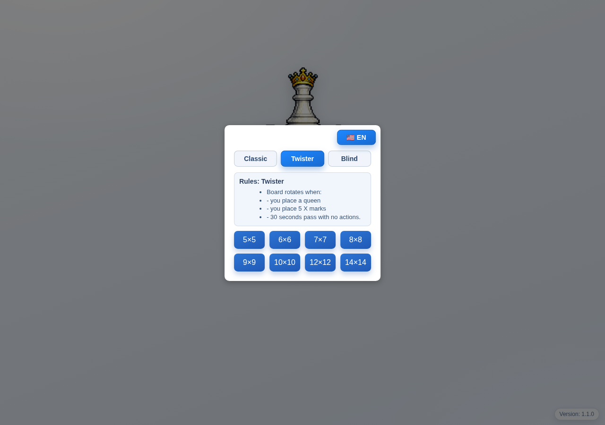
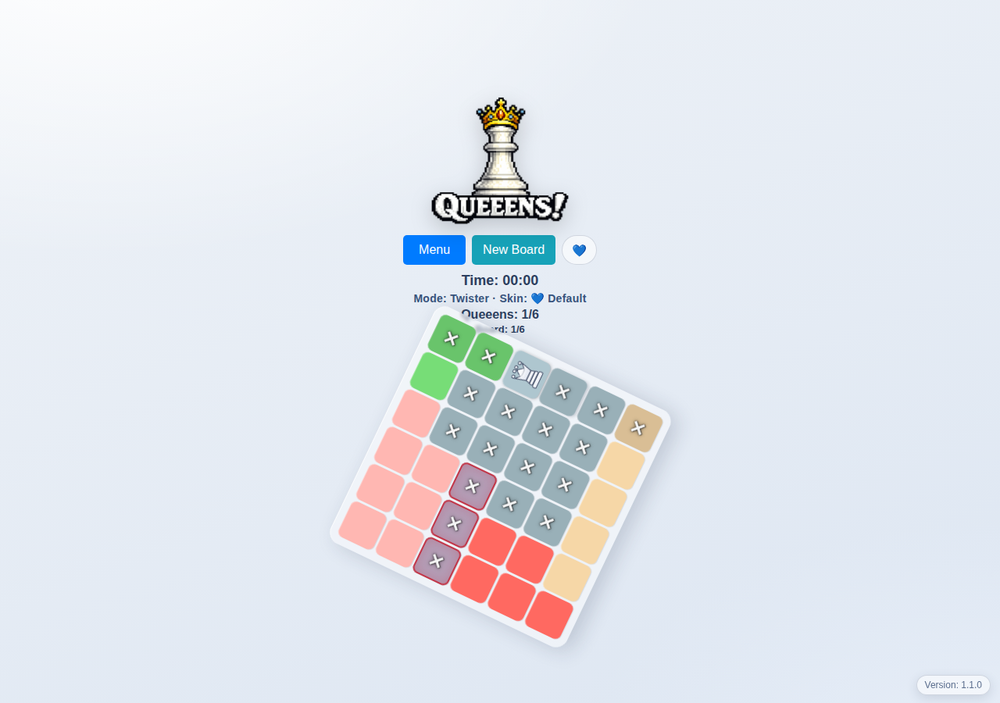
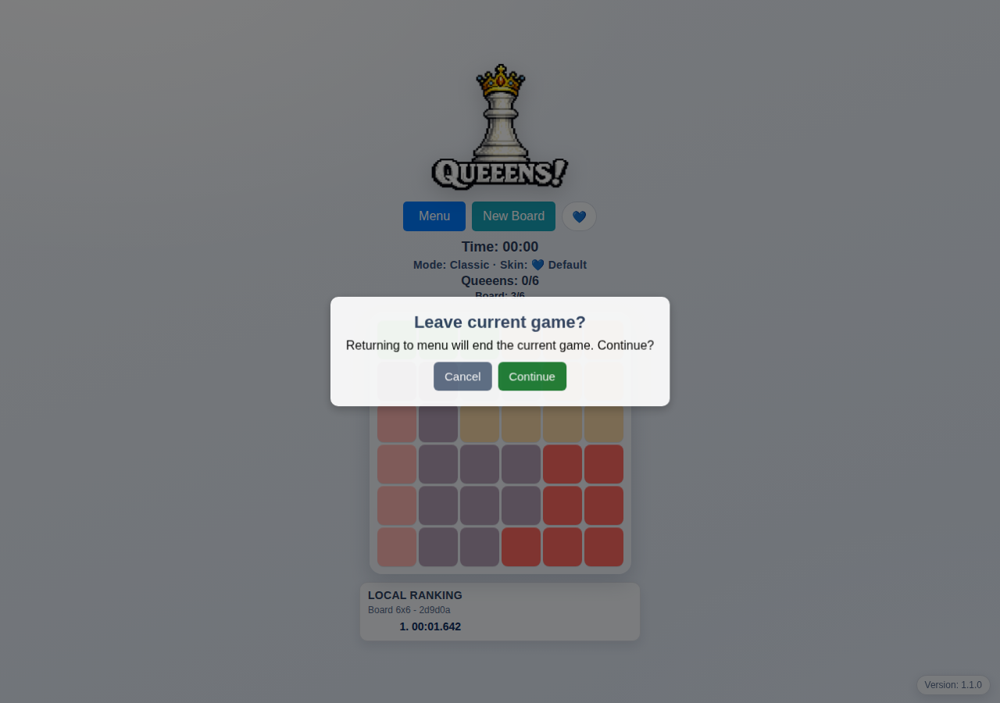

## ▶️ Acceso a la aplicación web

[¡Juega ahora en GitHub Pages!](https://dierodfer.github.io/queeens/)

Fast, clean, and a little chaotic.
Queeens is a logic puzzle game built with React, TypeScript and Vite, where you place one queen per region without conflicts, based on the 8 queens problem.

<p>
  
  
  
</p>

## Game Rules ♟️

- Place exactly one queen in each region.
- Avoid conflicts in the same row.
- Avoid conflicts in the same column.
- Avoid adjacent diagonals.
- Avoid placing queens in the same region/color.

Attacked cells are marked and blocked for queen placement, so the board stays readable while you solve.

## Modos de juego ✨

- **Classic** — the standard puzzle: place one queen per region with no two
  queens sharing a row, column, or short diagonal.
- **Twister** — same rules as Classic, but the board rotates every time you
  place a queen, mark 5 X cells, or after 30 seconds of inactivity.
- **Blind** — memorize the region colors during a preview countdown, then
  solve the board with the colors hidden. Choose `Easy`, `Medium`, or `Hard`
  to change how long you get to memorize it.

## Quick Start 🚀

```bash
npm install
npm start
```

Other useful commands:

```bash
npm run dev          # start the dev server
npm run build        # production build
npm run preview      # preview the production build
npm run typecheck    # TypeScript type checking
npm run lint         # ESLint
npm run format       # format with Prettier
npm test             # run the unit tests (Vitest)
```

## Project Structure 📁

```text
.
├── .github/workflows/   # CI/CD: deploy and release automation
├── public/               # static assets served as-is
├── src/
│   ├── app/               # components, hooks and game orchestration
│   ├── assets/            # images and icons
│   ├── data/              # board definitions
│   ├── i18n/              # translations
│   ├── lib/                # pure game logic + unit tests
│   └── main.tsx
└── ...config files (vite, tsconfig, eslint, prettier, vitest)
```

## Architecture 🧩

The code is organized in layers so each piece stays small and focused:

- **`src/lib/`** — pure, framework-agnostic game logic (conflict/attack
  detection, board rotation, ranking, time formatting, blind timing). No React,
  fully unit-tested.
- **`src/app/hooks/`** — stateful behavior isolated from rendering: `useTimer`
  (stopwatch), `useBlindPreview` (memorize countdown) and `useTwisterRotation`
  (board rotation triggers and timers).
- **`src/app/components/`** — presentational components that only render props.
- **`src/app/Queeens.tsx`** — orchestrates state and wires the hooks and
  components together.

## Testing 🧪

Unit tests run with [Vitest](https://vitest.dev/) and cover the pure logic in
`src/lib/` (conflict/attack detection, rotation, ranking storage, formatting and
blind timing).

```bash
npm test          # run once
npm run test:watch # watch mode
```
